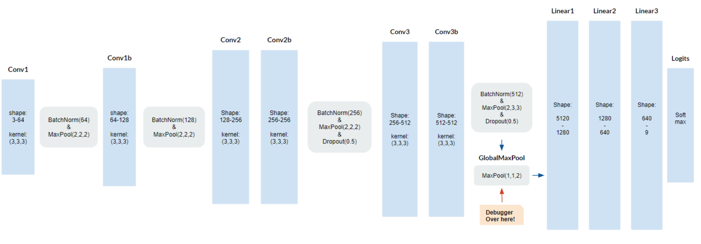
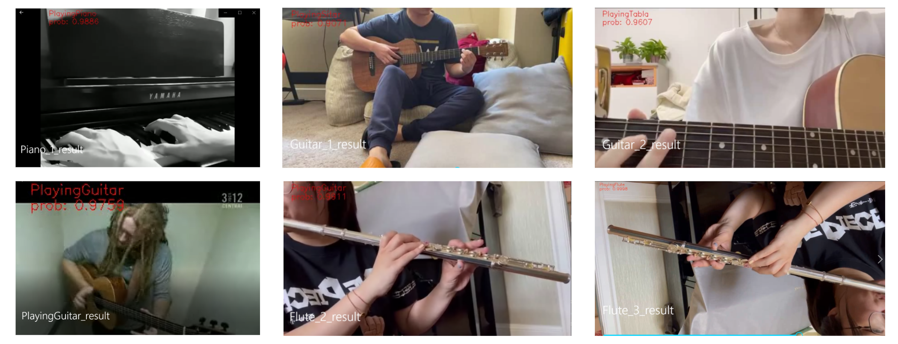

# ML2-Final-Project
This is a repository for the Final Project of Machine Learning 2 (Deep Learning) 

## DATASET
Data based on the UCF101 - Action Recognition Data Set https://www.crcv.ucf.edu/data/UCF101.php. UCF101 is an action recognition data set of realistic action videos, collected from YouTube, having 101 action categories. This data set is an extension of UCF50 data set which has 50 action categories.

We focus on the playing Musical Instruments group. They have 1268 clips in total, and each of them contains 4-7 videos, and the videos from the same group have some similar characteristics, such as background, characters, etc. This dataset is large enough to train a deep network.

## FRAMEWORK
Since we want to customize the network ourselves, PyTorch is the best option for debugging and changing network architectures.

## NETWORK
The network we used is based on CNN3D. The 3D convolution kernel is more efficient for spatiotemporal feature learning. Tran et. (2015) proposes a network called C3D, and we will customize it with different kernel size or neural size to learn this architecture more clearly.

## RESULT
In this project, we implemented a modified version of the C3D network, VC3D to better deal with the video classification task. While it achieved 100% accuracy in the Playing Instruments group for a random heldout test set that consisted of 15% of the full data, robustness issues were exposed when inference on videos collected from external sources.

On the lower left, a guitar performance clip from the UCF101 test set was used as control. Our model could classify it properly with high confidence. On the upper left, a piano-playing clip could be classified correctly as well, even if it is a greyscale video. But things went sideways than on. Our model failed to classify two guitar performances on the center, and label them as tabla and sitar. Indeed, these two instruments share similarities in exterior shape and playing methods with the guitar, and these two clips were filmed from different distances and angles with respect to the performer than our training data, but this certainly shows the model is not robust enough. An even more bizarre outcome was revealed, when we find the model could not properly classify a flute performance on the upper right, while when we flip that clip upside down like in the lower right, the model recognizes the action! The reason behind this unexpected behavior is yet to be identified.

## Reference
Tran, D., Bourdev, L., Fergus, R., Torresani, L., & Paluri, M. (2015). Learning spatiotemporal features with 3d convolutional networks. In Proceedings of the IEEE international conference on computer vision (pp. 4489-4497).

